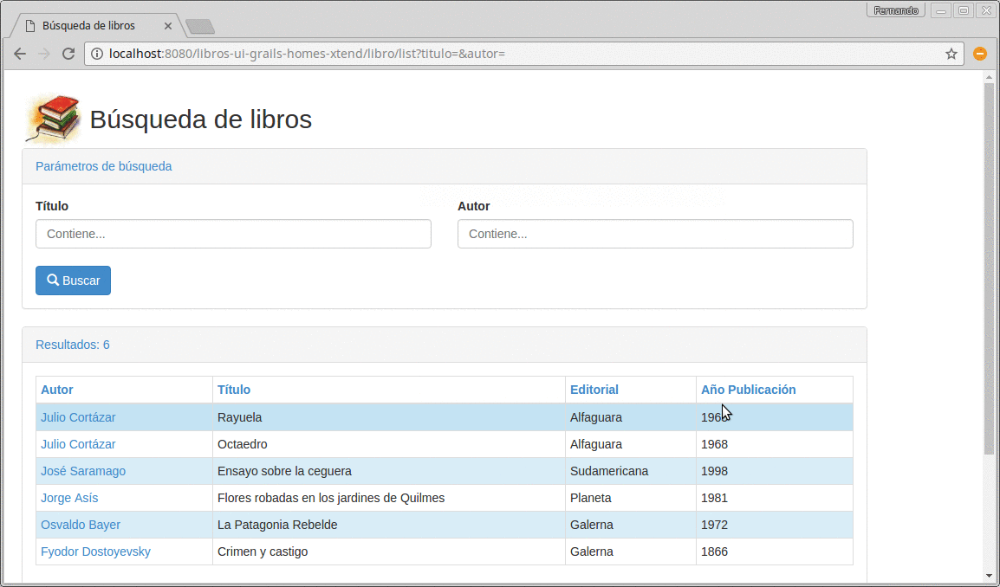

# Actualización de Libros en Grails

 

## Explicación

Se encuentra en [este apunte](https://docs.google.com/document/d/1g9Q7TxWU5hJu6_V8r63eSCek1EC1PCTL-f310XzDANE/edit#heading=h.z0vrvi6xk0zu)
donde se cuenta la navegación entre

* la pantalla de búsqueda
* y la edición/consulta de un libro

## Consideraciones

* [Instalar el plugin de Xtend](http://uqbar-wiki.org/index.php?title=Integraci%C3%B3n_Grails_con_Xtend)
* El objeto de dominio está en Xtend
* También el repositorio (objeto de acceso a datos)
* Los controllers y las vistas son propias de Grails

## Versiones actuales

* Grails 2.4.2
* en un entorno GGTS 3.6.0
* con Twitter Boostrap 3.2.0
* con Xtend 2.10.0 

